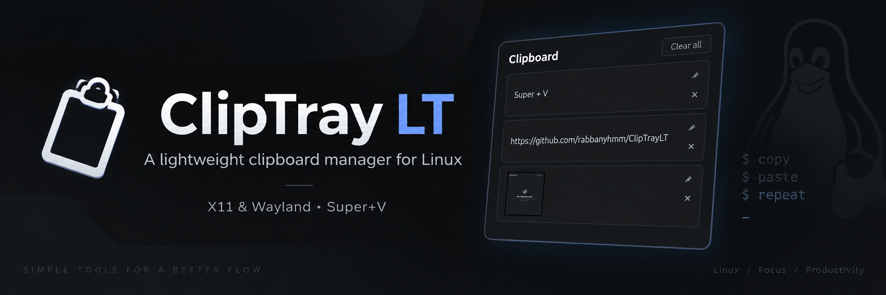

<p align="center">
  
</p>

# ClipTray LT

A lightweight clipboard manager for Linux (X11 & Wayland).

## Features

- History flyout for copied text and images
- Pin favorite items to keep them permanently
- Click an item to paste it directly into active application
- Volatile RAM storage by default (optional disk persistence)
- Global `Super+V` hotkey

## Install

```bash
git clone https://github.com/rabbanyhmm/ClipTrayLT.git
cd ClipTrayLT
./install.sh
```

## Update

```bash
./update.sh
```

To uninstall: `./uninstall.sh`

## Commands

### Settings
```bash
# View configuration
cliptraylt config show

# Set item limit (default: 25)
cliptraylt config set max_items 50

# Save to disk (default: false / RAM only)
cliptraylt config set save_to_disk true

# Reset to defaults
cliptraylt config reset
```

### Controls
```bash
cliptraylt --toggle    # Toggle flyout
cliptraylt --clear     # Clear unpinned items
cliptraylt --stop      # Stop daemon
cliptraylt --help      # Show help
```
